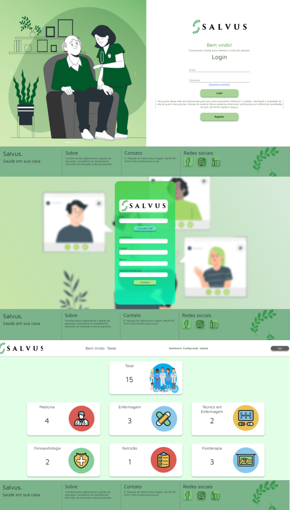

# React-Auth-Login

Instalando o projeto

1- Adicionar manualmente o banco de dados chamado db_salvus, em seguida importar a dump com o nome "Backup" na pasta /dump deste projeto github  
2- Instalar o node_modules usando o "npm i" ou "npm install" tanto no client(front-end) quanto no server(back-end), ambos pastas que se encontram na main do projeto e em seguida iniciar ambos os projetos usando "npm run start" ou "npm start". 

O projeto possui... ->

1- Uma página de login com opções de logar, recuperar a senha via email e registrar um novo profissional de saúde; 
2- O formulário de registro é separado em 3 partes, O primeiro voltado a pessoa, o segundo ao endereço e o terceiro voltado aos dados da profissão. Todos os campos possuem validação para não prosseguir o Registro caso um ou mais campos estiverem vazio, e na parte de preenchimento de dados do Endereço possui a opção de consultar o endereço pelo CEP através de uma requisição API externa; 
3- Existe a opção de recuperar a senha, na qual é enviado um código para o email e através dele, e exclusivamente dele, é possível recuperar a senha; 
4- Ao se logar, o sistema verifica no backend se o usuário e senha existem, caso não, um alert irá surgir, caso exista, o login é realizado; 
5- Efetuado o login é possível perceber que é impossível acessar a página de login, como também se o usuário não estiver logado é impossível acessar páginas exclusivas para usuários online;  
6- O site comtém um Header que mostra o nome do usuário atual, menu de locomoção entre páginas e uma opção de sair, onde faz logout e encerra a sessão;
7- Ao logar a primeira página é o Dashboard, nele contém os dados de todos os usuários cadastrados e a quantidade de profissionais cadastrados de acordo com a profissão; 
8- No settings há a opção de fazer a Atualização dos dados de apenas 3 campos, Ainda em settings é possível excluir a sua conta;  
9- Existe também uma página chamada upload, o arquivo enviado é carregano em uma pasta chamada "uploads" que se encontra no server(back-end).

Obs: O projeto não foi pensado sobre a responsividade, então dependendo da resolução do monitor a experiencia pode ser diferente.

